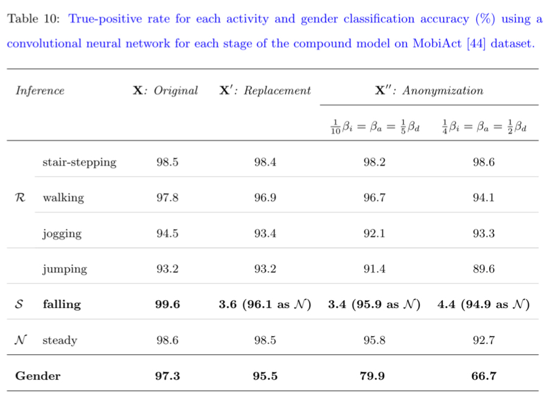

### Addtional Resutls for our PMC Journal Paper: [Privacy and Utility Preserving Sensor-Data Transformations](https://arxiv.org/pdf/1911.05996.pdf)

#### (1) Brief Description of the Resutls
To show that the compound architecture, proposed in the paper, can generalize across datasets, we repeat the same experiment as Table 9 (in the [paper](https://arxiv.org/pdf/1911.05996.pdf)) on another dataset ([MobiAct](https://bmi.teicrete.gr/en/the-mobifall-and-mobiact-datasets-2/)) by keeping the same architecture for RAE and AAE.

In this experiment we consider all kind of **falls** as **sensitive** activities, assuming that they can be considered as symptoms of some diseases. We also consider being **steady** as a **neutral** activity, which in this dataset it means either **sitting** or **standing**. 

We see summary of the results for two different settings for utility-privacy parameters in the below image, that show almost similar results to what we have on the [MotionSense](https://www.kaggle.com/malekzadeh/motionsense-dataset) dataset in Table 9 in the paper.

Accuracy of recognizing the **required** activities are almost same before and after transformations, while accuracy in detecting falls is dropped from 99.6\% to less than 4.5\%. Moreover, we can reduce the adversary's accuracy in detecting gender from 97.35\% to 66.8\%, which is close to the random guess in this dataset that is 74.5\%.

Note that in this dataset we have 41 males and 14 females. So, randomly guessing a subject as male is 74.5\% accurate.($\frac{41 \text{ males}}{55 \text{ males and females}}=74.5$).}

|  |
|:---:|
| Reproducing results of Table 9 in the paper (MotionSens dataset) on another dataset (MobiActdataset). |

* Note that this notebook just use all the already trained models. If you want to train your own models for each stage, please look at other files in this repository.


#### (2) Import required libraries 


```python
import numpy as np
import pandas as pd
import matplotlib.pyplot as plt
import tensorflow as tf
import tensorflow.keras as keras
from scipy import stats
pd.set_option('display.float_format', lambda x: '%.4f' % x)
```


<p style="color: red;">
The default version of TensorFlow in Colab will soon switch to TensorFlow 2.x.<br>
We recommend you <a href="https://www.tensorflow.org/guide/migrate" target="_blank">upgrade</a> now 
or ensure your notebook will continue to use TensorFlow 1.x via the <code>%tensorflow_version 1.x</code> magic:
<a href="https://colab.research.google.com/notebooks/tensorflow_version.ipynb" target="_blank">more info</a>.</p>


#### (3) Dataset
(Dataset is available here: [The MobiFall and MobiAct datasets](https://bmi.teicrete.gr/en/the-mobifall-and-mobiact-datasets-2/))

We choose 6 activities in the dataset.

* **STR**: satir-stepping, including both staris down or stairs up"
* **WAL**: walking
* **JOG**: jogging
* **JUM**: jumpping
* **STD**: being steady: either sitting or standing 
* **FALL**: falling (Suddenly from standing position to the floor)

#### Name and Code of each Class


```python
act_list = ["STR","WAL","JOG","JUM","STD","FALL"]
gender_labels = ["Female", "Male"]
for i, a in enumerate(act_list):
  print(i,":",a, end=" | ")
print()
for i, a in enumerate(gender_labels):
  print(i,":",a, end=" | ")
```

    0 : STR | 1 : WAL | 2 : JOG | 3 : JUM | 4 : STD | 5 : FALL | 
    0 : Female | 1 : Male | 

#### Loading Train and Test Data
(Note: File XXXX shows hos we build this datasets from the original MobiAct dataset)


```python
x_train = np.load("x_train.npy", allow_pickle=True)
x_test = np.load("x_test.npy", allow_pickle=True)
y_train = np.load("y_train.npy",allow_pickle=True)
y_test = np.load("y_test.npy",allow_pickle=True)
y_train = y_train.astype(int)
y_test = y_test.astype(int)
```


```python
nb_classes = len(np.unique(y_test[:,0]))
batch_size = 64

Y_train = keras.utils.to_categorical(y_train[:,0], nb_classes)
Y_test = keras.utils.to_categorical(y_test[:,0], nb_classes)
x_train = x_train.reshape((x_train.shape[0], x_train.shape[1], x_train.shape[2] ,1))
x_test = x_test.reshape((x_test.shape[0], x_test.shape[1], x_test.shape[2] ,1))
x_train.shape, Y_train.shape, x_test.shape, Y_test.shape
```


    ((182220, 128, 9, 1), (182220, 6), (38617, 128, 9, 1), (38617, 6))


```python
np.set_printoptions(suppress=True)

import seaborn as sns
from sklearn.metrics import confusion_matrix

## src: https://gist.github.com/hitvoice/36cf44689065ca9b927431546381a3f7
def cm_analysis(y_true, y_pred, labels, ymap=None, figsize=(10,10)):
    cm = confusion_matrix(y_true, y_pred, labels=range(len(labels)))
    cm_sum = np.sum(cm, axis=1, keepdims=True)
    cm_perc = cm / cm_sum.astype(float) * 100
    print(labels)
    print(cm_perc.round(1))
```

#### Original Data (without any transformation)

##### Activity Recognition


```python
model = keras.models.load_model('_best_FCN_.hdf5')
preds = model.predict(x_test)
preds = preds.argmax(axis=1)
cm_analysis(y_test[:,0], preds, act_list, figsize=(16,16))

from sklearn.metrics import f1_score
print("f1: ", np.round(f1_score(y_test[:,0], preds, average='macro')*100,2))
print("acc: ", np.round(model.evaluate(x_test, Y_test, verbose=0)[1]*100,2))
```

    WARNING:tensorflow:From /usr/local/lib/python3.6/dist-packages/tensorflow_core/python/ops/init_ops.py:97: calling GlorotUniform.__init__ (from tensorflow.python.ops.init_ops) with dtype is deprecated and will be removed in a future version.
    Instructions for updating:
    Call initializer instance with the dtype argument instead of passing it to the constructor
    WARNING:tensorflow:From /usr/local/lib/python3.6/dist-packages/tensorflow_core/python/ops/init_ops.py:97: calling Zeros.__init__ (from tensorflow.python.ops.init_ops) with dtype is deprecated and will be removed in a future version.
    Instructions for updating:
    Call initializer instance with the dtype argument instead of passing it to the constructor
    WARNING:tensorflow:From /usr/local/lib/python3.6/dist-packages/tensorflow_core/python/ops/init_ops.py:97: calling Ones.__init__ (from tensorflow.python.ops.init_ops) with dtype is deprecated and will be removed in a future version.
    Instructions for updating:
    Call initializer instance with the dtype argument instead of passing it to the constructor
    WARNING:tensorflow:From /usr/local/lib/python3.6/dist-packages/tensorflow_core/python/ops/resource_variable_ops.py:1630: calling BaseResourceVariable.__init__ (from tensorflow.python.ops.resource_variable_ops) with constraint is deprecated and will be removed in a future version.
    Instructions for updating:
    If using Keras pass *_constraint arguments to layers.
    ['STR', 'WAL', 'JOG', 'JUM', 'STD', 'FALL']
    [[98.5  0.5  0.2  0.   0.7  0.1]
     [ 0.9 97.8  0.   0.   1.2  0.2]
     [ 0.6  0.1 94.5  4.8  0.   0. ]
     [ 1.6  0.   5.1 93.2  0.1  0. ]
     [ 0.1  1.   0.   0.  98.6  0.2]
     [ 0.   0.   0.   0.   0.4 99.6]]
    f1:  97.07
    acc:  97.55


## Replacement

As we said, we do not want the app to infer when falls happen, while we want them to infer the other four moving activites ('STR', 'WAL', 'JOG', 'JUM') as accurate as possible.


```python
rae = keras.models.load_model("_RAE_model.hdf5")
rep_x_test = rae.predict(x_test, verbose=1)

# model = keras.models.load_model('_best_FCN_.hdf5')
preds = model.predict(rep_x_test, verbose=1)
preds = preds.argmax(axis=1)
cm_analysis(y_test[:,0], preds, act_list, figsize=(16,16))
```

    WARNING:tensorflow:From /usr/local/lib/python3.6/dist-packages/tensorflow_core/python/keras/backend.py:4277: where (from tensorflow.python.ops.array_ops) is deprecated and will be removed in a future version.
    Instructions for updating:
    Use tf.where in 2.0, which has the same broadcast rule as np.where
    38617/38617 [==============================] - 7s 171us/sample
    38617/38617 [==============================] - 5s 134us/sample
    ['STR', 'WAL', 'JOG', 'JUM', 'STD', 'FALL']
    [[98.4  0.5  0.1  0.   1.   0. ]
     [ 1.5 96.9  0.   0.   1.3  0.3]
     [ 1.7  0.1 93.4  4.8  0.   0. ]
     [ 2.3  0.   4.5 93.2  0.   0. ]
     [ 0.3  0.9  0.   0.  98.5  0.2]
     [ 0.3  0.   0.   0.  96.1  3.6]]


### How about gender information?
So, we can hid falls and they are inferred as being steady, while we share the moving activites ('STR', 'WAL', 'JOG', 'JUM') with minimum distortion. 
The question is: what if somebody could infer our gender from them, when they are not supposed to infer it?!

* First, let's see how's the accuracy of gender classifier on the output of RAE: So, we choose the required activites and give them to the already trained gender classifier.


```python
print("Required", end="--> ")
wl = [0,1,2,3]
for i in wl:
    print(act_list[i], end="; ")

w_train_data = x_train[np.isin(y_train[:,0],wl)]
w_act_train_labels = y_train[np.isin(y_train[:,0],wl)][:,0]
w_gen_train_labels = y_train[np.isin(y_train[:,0],wl)][:,1]
print(w_train_data.shape,w_act_train_labels.shape, w_gen_train_labels.shape)

w_test_data = x_test[np.isin(y_test[:,0],wl)]
w_act_test_labels = y_test[np.isin(y_test[:,0],wl)][:,0]
w_gen_test_labels = y_test[np.isin(y_test[:,0],wl)][:,1]
print(w_test_data.shape,w_act_test_labels.shape, w_gen_test_labels.shape)
```

    Required--> STR; WAL; JOG; JUM; (111709, 128, 9, 1) (111709,) (111709,)
    (22568, 128, 9, 1) (22568,) (22568,)


```python
eval_gen = keras.models.load_model('_best_gen_FCN_.hdf5')
preds = eval_gen.predict(w_test_data)
preds = (preds > 0.5).astype(int)[:,0]
cm_analysis(w_gen_test_labels, preds, ['F','M'], figsize=(16,16))
print("f1: ", np.round(f1_score(w_gen_test_labels, preds, average='macro')*100,2))
print("acc: ", np.round(eval_gen.evaluate(w_test_data, w_gen_test_labels, verbose=0)[1]*100,2))
```

    ['F', 'M']
    [[96.4  3.6]
     [ 2.3 97.7]]
    f1:  96.74
    acc:  97.35


```python
w_data_train_rep = w_train_data.copy()
w_data_train_rep = rae.predict(w_data_train_rep, verbose=1)
w_data_test_rep = w_test_data.copy()
w_data_test_rep = rae.predict(w_data_test_rep, verbose=1)
```

    111709/111709 [==============================] - 20s 176us/sample
    22568/22568 [==============================] - 4s 171us/sample


```python
preds = eval_gen.predict(w_data_test_rep)
preds = (preds > 0.5).astype(int)[:,0]
cm_analysis(w_gen_test_labels, preds, ['F','M'], figsize=(16,16))
print("f1: ", np.round(f1_score(w_gen_test_labels, preds, average='macro')*100,2))
print("acc: ", np.round(eval_gen.evaluate(w_data_test_rep, w_gen_test_labels, verbose=0)[1]*100,2))
```

    ['F', 'M']
    [[96.7  3.3]
     [ 3.8 96.2]]
    f1:  95.57
    acc:  96.35


Thus, if the adversary look at the non-sensitive activities such as walking, they can accurately infer the gender. And as we see, even if adversaries do not use the raw data and just look at the output of RAE, they still can infer gender with high accuracy.

## Anonymization

Now, we build the AAE and give it the output of the RAE with the goal of hiding the gender.


```python
class Enc_Reg:
    l2p = 0.001
    @staticmethod
    def early_layers(inp, fm, hid_act_func):
        # Start
        x = Conv2D(32, fm, padding="same", kernel_regularizer=regularizers.l2(Enc_Reg.l2p), activation=hid_act_func)(inp)
        x = MaxPooling2D(pool_size=(2, 1))(x)
        x = Dropout(0.25)(x)
        
        # 1
        x = Conv2D(32, fm, padding="same", kernel_regularizer=regularizers.l2(Enc_Reg.l2p), activation=hid_act_func)(x)
        x = MaxPooling2D(pool_size=(2, 1))(x)
        x = Dropout(0.25)(x)

        return x
    
    @staticmethod
    def late_layers(inp, num_classes, fm, act_func, hid_act_func):
        # 2
        x = Conv2D(32, fm, padding="same", kernel_regularizer=regularizers.l2(Enc_Reg.l2p), activation=hid_act_func)(inp)
        x = MaxPooling2D(pool_size=(2, 1))(x)
        x = Dropout(0.25)(x)
        
        # End
        x = Flatten()(x)
        x = Dense(64, kernel_regularizer=regularizers.l2(Enc_Reg.l2p), activation=hid_act_func)(x)
        x = Dropout(0.5)(x)
        x = Dense(16, kernel_regularizer=regularizers.l2(Enc_Reg.l2p), activation=hid_act_func)(x)
        x = Dropout(0.5)(x)
        x = Dense(num_classes, activation=act_func)(x)

        return x
   
    @staticmethod
    def build(height, width, num_classes, name, fm, act_func,hid_act_func):
        inp = Input(shape=(height, width, 1))
        early = Enc_Reg.early_layers(inp, fm, hid_act_func=hid_act_func)
        late  = Enc_Reg.late_layers(early, num_classes, fm, act_func=act_func, hid_act_func=hid_act_func)
        model = Model(inputs=inp, outputs=late ,name=name)
        return model


class Dec_Reg:
    l2p = 0.001
    @staticmethod
    def early_layers(inp, fm, hid_act_func):
        # Start
        x = Conv2D(32, fm, padding="same", kernel_regularizer=regularizers.l2(Dec_Reg.l2p), activation=hid_act_func)(inp)
        x = MaxPooling2D(pool_size=(2, 1))(x)
        x = Dropout(0.25)(x)
        
        # 1
        x = Conv2D(32, fm, padding="same", kernel_regularizer=regularizers.l2(Dec_Reg.l2p), activation=hid_act_func)(x)
        x = MaxPooling2D(pool_size=(2, 1))(x)
        x = Dropout(0.25)(x)


        return x
    
    @staticmethod
    def late_layers(inp, num_classes, fm, act_func, hid_act_func):
        # 2
        x = Conv2D(32, fm, padding="same", kernel_regularizer=regularizers.l2(Dec_Reg.l2p), activation=hid_act_func)(inp)
        x = MaxPooling2D(pool_size=(2, 1))(x)
        x = Dropout(0.25)(x)
        
        # 3
        x = Conv2D(32, fm, padding="same", kernel_regularizer=regularizers.l2(Dec_Reg.l2p), activation=hid_act_func)(x)
        x = MaxPooling2D(pool_size=(2, 1))(x)
        x = Dropout(0.25)(x)
        
        #4
        x = Conv2D(32, fm, padding="same", kernel_regularizer=regularizers.l2(Dec_Reg.l2p), activation=hid_act_func)(x)
        x = MaxPooling2D(pool_size=(2, 1))(x)
        x = Dropout(0.25)(x)
        
        
        # End
        x = Flatten()(x)
        x = Dense(128, kernel_regularizer=regularizers.l2(Dec_Reg.l2p), activation=hid_act_func)(x)
        x = Dropout(0.5)(x)
        x = Dense(32, kernel_regularizer=regularizers.l2(Dec_Reg.l2p), activation=hid_act_func)(x)
        x = Dropout(0.5)(x)
        x = Dense(num_classes, activation=act_func)(x)

        return x
   
    @staticmethod
    def build(height, width, num_classes, name, fm, act_func,hid_act_func):
        inp = Input(shape=(height, width, 1))
        early = Dec_Reg.early_layers(inp, fm, hid_act_func=hid_act_func)
        late  = Dec_Reg.late_layers(early, num_classes, fm, act_func=act_func, hid_act_func=hid_act_func)
        model = Model(inputs=inp, outputs=late ,name=name)
        return model


class Encoder:
    l2p = 0.0001
    @staticmethod
    def layers(x, fm, act_func, hid_act_func):
        x = Conv2D(64, fm, activation=hid_act_func, kernel_regularizer=regularizers.l2(Encoder.l2p), padding='same')(x)
        x = BatchNormalization()(x)
        
        x = Conv2D(64, fm, activation=hid_act_func, kernel_regularizer=regularizers.l2(Encoder.l2p), padding='same')(x)
        x = BatchNormalization()(x)
        x = MaxPooling2D(pool_size=(2,1))(x)

        x = Conv2D(64, fm, activation=hid_act_func,kernel_regularizer=regularizers.l2(Encoder.l2p), padding='same')(x)
        x = BatchNormalization()(x)
        x = MaxPooling2D(pool_size=(2,1))(x)

        x = Conv2D(1, fm, activation=act_func, padding='same')(x) 
        y = BatchNormalization()(x)

        return y
   
    @staticmethod
    def build(height, width, fm, act_func, hid_act_func):
        inp = Input(shape=(height, width,1))
        enc = Encoder.layers(inp, fm, act_func=act_func, hid_act_func=hid_act_func)
        model = Model(inputs=inp, outputs=enc ,name="Encoder")
        return model

class Decoder:
    l2p = 0.0001
    @staticmethod
    def layers(y, height, width, fm, act_func, hid_act_func):
        
        x = Conv2DTranspose(64, fm, strides = (1, 1), activation=hid_act_func,kernel_regularizer=regularizers.l2(Decoder.l2p), padding='same')(y)
        x = BatchNormalization()(x)
        x = Conv2DTranspose(64, fm,  strides = (2, 1), activation=hid_act_func,kernel_regularizer=regularizers.l2(Decoder.l2p), padding='same')(x)
        x = BatchNormalization()(x)
        x = Conv2DTranspose(64, fm, strides = (2, 1), activation=hid_act_func,kernel_regularizer=regularizers.l2(Decoder.l2p), padding='same')(x)
        x = BatchNormalization()(x)
        
        xh = Conv2D(1, fm, activation=act_func, padding='same')(x)
        return xh
   
    @staticmethod
    def build(height, width, fm , act_func, hid_act_func):
        inp = Input(shape=(height, width,1))
        dec  = Decoder.layers(inp,height, width, fm, act_func=act_func, hid_act_func=hid_act_func)
        model = Model(inputs=inp, outputs=dec ,name="Decoder")
        return model        
```


```python
import keras.backend as K
def gen_equ_loss_func(y_true, y_pred):
    loss = K.mean(K.abs(0.5 - y_pred))
    return loss

def build_AAE(loss_weights):
    id_class_numbers = 1
    act_class_numbers = 4
    #fm = (2,3)
    #reps_id = Enc_Reg.build(height, width//4, id_class_numbers, name ="EncReg", fm=fm, act_func="sigmoid",hid_act_func="relu")
    fm = (5,9)
    rcon_id = Dec_Reg.build(height, width, id_class_numbers, name ="GenReg", fm=fm, act_func="sigmoid",hid_act_func="relu")
    # print(rcon_id.summary())
    rcon_task = Dec_Reg.build(height, width, act_class_numbers, name ="ActReg", fm=fm, act_func="softmax",hid_act_func="relu")
    # print(rcon_task.summary())
    #reps_id.compile( loss="binary_crossentropy", optimizer='adam', metrics=['acc'])
    rcon_id.compile( loss="binary_crossentropy", optimizer='adam', metrics=['acc'])
    rcon_task.compile( loss="categorical_crossentropy", optimizer='adam', metrics=['acc'])

    #reps_id.trainable = False
    rcon_id.trainable = False
    rcon_task.trainable = False

    enc_to_reps = Encoder.build(height, width, fm=fm, act_func="linear", hid_act_func="relu")
    # print(enc_to_reps.summary())
    reps_to_dec = Decoder.build(height//4, width, fm=fm, act_func="linear", hid_act_func="relu")
    # print(reps_to_dec.summary())
    enc_to_reps.compile( loss="mean_squared_error", optimizer='adam', metrics=['mse'])
    reps_to_dec.compile( loss="mean_squared_error", optimizer='adam', metrics=['mse'])

    x = Input(shape=(height, width,1))
    z = enc_to_reps(x)
    #idz = reps_id(z)
    xh = reps_to_dec(z)
    idxh = rcon_id(xh)
    txh = rcon_task(xh)


    anon_model = Model(inputs = x,
                       outputs = [xh,
                                  #idz,
                                  idxh,
                                  txh
                                 ],
                       name ="anon") 
    anon_model.compile(loss = ["mean_squared_error",
                               #"binary_crossentropy",
                                gen_equ_loss_func,
                               "categorical_crossentropy"
                              ],
                       loss_weights = loss_weights,                 
                       optimizer = "adam",
                       metrics = ["acc"])
    #enc_to_reps.set_weights(enc_dec_tmp.layers[1].get_weights()) 
    #reps_to_dec.set_weights(enc_dec_tmp.layers[2].get_weights()) 


    return anon_model, rcon_task, rcon_id

from tensorflow.keras.layers import *
from tensorflow.keras import Model
from tensorflow.keras import regularizers
height = w_data_train_rep.shape[1]
width = w_data_train_rep.shape[2]
fm = (5,9)
loss_weights=[2, 1, 4]            
anon_model, rcon_task, rcon_id = build_AAE(loss_weights)
anon_model.summary()
```

    Using TensorFlow backend.


    Model: "anon"
    __________________________________________________________________________________________________
    Layer (type)                    Output Shape         Param #     Connected to                     
    ==================================================================================================
    input_5 (InputLayer)            [(None, 128, 9, 1)]  0                                            
    __________________________________________________________________________________________________
    Encoder (Model)                 (None, 32, 9, 1)     375365      input_5[0][0]                    
    __________________________________________________________________________________________________
    Decoder (Model)                 (None, 128, 9, 1)    375361      Encoder[1][0]                    
    __________________________________________________________________________________________________
    GenReg (Model)                  (None, 1)            337665      Decoder[1][0]                    
    __________________________________________________________________________________________________
    ActReg (Model)                  (None, 4)            337764      Decoder[1][0]                    
    ==================================================================================================
    Total params: 1,426,155
    Trainable params: 749,956
    Non-trainable params: 676,199
    __________________________________________________________________________________________________


Here we can see the results of anonymization by AAE (hiding the gender in this case) for three different settings of trade-off parameters.


```python
anon_model.load_weights('gender_anon_1.h5')
rep_anon_test = anon_model.predict(rep_x_test, verbose = 1)[0]


eval_act = keras.models.load_model('_best_FCN_.hdf5')
preds = eval_act.predict(rep_anon_test, verbose=1)
preds = preds.argmax(axis=1)
cm_analysis(y_test[:,0], preds, act_list, figsize=(16,16))


eval_gen = keras.models.load_model('_best_gen_FCN_.hdf5')
preds = eval_gen.predict(rep_anon_test)
preds = (preds > 0.5).astype(int)[:,0]
cm_analysis(y_test[:,1], preds, ['F','M'], figsize=(16,16))
print("f1: ", np.round(f1_score(y_test[:,1], preds, average='macro')*100,2))
print("acc: ", np.round(eval_gen.evaluate(rep_anon_test, y_test[:,1], verbose=0)[1]*100,2))
```

    38617/38617 [==============================] - 11s 295us/sample
    38617/38617 [==============================] - 6s 146us/sample
    ['STR', 'WAL', 'JOG', 'JUM', 'STD', 'FALL']
    [[98.2  0.9  0.   0.   0.9  0. ]
     [ 1.8 96.7  0.   0.   1.2  0.3]
     [ 3.3  0.1 92.1  4.5  0.   0. ]
     [ 4.3  0.   4.3 91.4  0.   0. ]
     [ 0.5  1.   0.   0.  95.8  2.6]
     [ 0.7  0.   0.   0.  95.9  3.4]]
    ['F', 'M']
    [[63.5 36.5]
     [13.8 86.2]]
    f1:  74.9
    acc:  79.96


```python
anon_model.load_weights('gender_anon_2.h5')

rep_anon_test = anon_model.predict(rep_x_test, verbose = 1)[0]

eval_act = keras.models.load_model('_best_FCN_.hdf5')
preds = eval_act.predict(rep_anon_test, verbose=1)
preds = preds.argmax(axis=1)
cm_analysis(y_test[:,0], preds, act_list, figsize=(16,16))


eval_gen = keras.models.load_model('_best_gen_FCN_.hdf5')
preds = eval_gen.predict(rep_anon_test)
preds = (preds > 0.5).astype(int)[:,0]
cm_analysis(y_test[:,1], preds, ['F','M'], figsize=(16,16))
print("f1: ", np.round(f1_score(y_test[:,1], preds, average='macro')*100,2))
print("acc: ", np.round(eval_gen.evaluate(rep_anon_test, y_test[:,1], verbose=0)[1]*100,2))
```

    38617/38617 [==============================] - 11s 283us/sample
    38617/38617 [==============================] - 6s 150us/sample
    ['STR', 'WAL', 'JOG', 'JUM', 'STD', 'FALL']
    [[99.3  0.4  0.   0.   0.4  0. ]
     [ 4.5 94.1  0.   0.   1.2  0.3]
     [ 4.   0.1 92.1  3.8  0.   0. ]
     [ 5.5  0.   4.8 89.6  0.   0. ]
     [ 1.3  0.9  0.   0.  96.3  1.5]
     [ 0.8  0.   0.   0.  95.7  3.4]]
    ['F', 'M']
    [[71.7 28.3]
     [29.6 70.4]]
    f1:  67.59
    acc:  70.75


```python
anon_model.load_weights('gender_anon_3.h5')
rep_anon_test = anon_model.predict(rep_x_test, verbose = 1)[0]


eval_act = keras.models.load_model('_best_FCN_.hdf5')
preds = eval_act.predict(rep_anon_test, verbose=1)
preds = preds.argmax(axis=1)
cm_analysis(y_test[:,0], preds, act_list, figsize=(16,16))


eval_gen = keras.models.load_model('_best_gen_FCN_.hdf5')
preds = eval_gen.predict(rep_anon_test)
preds = (preds > 0.5).astype(int)[:,0]
cm_analysis(y_test[:,1], preds, ['F','M'], figsize=(16,16))
print("f1: ", np.round(f1_score(y_test[:,1], preds, average='macro')*100,2))
print("acc: ", np.round(eval_gen.evaluate(rep_anon_test, y_test[:,1], verbose=0)[1]*100,2))
```

    38617/38617 [==============================] - 11s 284us/sample
    38617/38617 [==============================] - 6s 157us/sample
    ['STR', 'WAL', 'JOG', 'JUM', 'STD', 'FALL']
    [[98.6  1.   0.   0.   0.4  0. ]
     [ 4.5 94.   0.   0.   1.   0.5]
     [ 2.5  0.1 93.3  4.   0.   0. ]
     [ 5.3  0.   5.2 89.6  0.   0. ]
     [ 4.9  1.   0.   0.  92.7  1.4]
     [ 0.7  0.   0.   0.  94.9  4.3]]
    ['F', 'M']
    [[71.9 28.1]
     [35.2 64.8]]
    f1:  64.13
    acc:  66.77


Finally, we see that after using the AAE we suffer a bit more accuracy loss. However, inferring the gender is so close to the random guess on this dataset.
